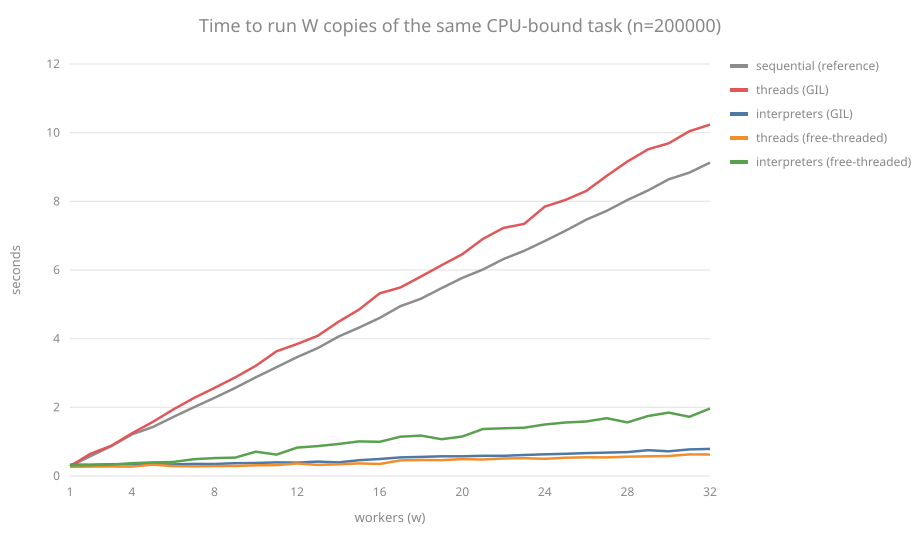

# Python 3.14 free-threading benchmark: GIL vs no-GIL vs subinterpreters

A **live, reproducible** benchmark of Python 3.14's new concurrency: the same CPU-bound function running sequentially, on `ThreadPoolExecutor`, and on `InterpreterPoolExecutor` ([PEP 734](https://peps.python.org/pep-0734/)), under both the standard build (GIL) and the **free-threaded 3.14t** build ([PEP 779](https://peps.python.org/pep-0779/), no GIL). A UI renders the results as bars and shows the real HTTP traffic.

The vehicle is an educational POC: a complete CRUD API written **only with the Python 3.14 standard library** (zero `pip install`), showcasing the newest language features: t-strings ([PEP 750](https://peps.python.org/pep-0750/)), `uuid.uuid7()`, `concurrent.interpreters` ([PEP 734](https://peps.python.org/pep-0734/)), structural pattern matching, and [PEP 695](https://peps.python.org/pep-0695/) type syntax. On top there is a vanilla-JS test front served by a static server built **only with Node 24 builtins** (zero `npm install`).

**Typical results (4 workers, n=200000, 32 cores):**

| Mode | Standard build (GIL) | Free-threaded build (no GIL) |
|---|---|---|
| sequential | ~909 ms | ~1045 ms |
| threads | ~1034 ms | **~279 ms** |
| interpreters | ~285 ms | ~359 ms |

With the GIL, threads are serialized (even slightly slower than sequential due to contention) while subinterpreters scale with cores thanks to the per-interpreter GIL. Without the GIL, threads finally parallelize, and even edge out subinterpreters since they skip the cross-interpreter marshalling. Same checksum in every mode and build.

## Scaling from 1 to 32 workers



Measured on a Ryzen 9 5950X (16 cores / 32 threads), n=200000, both builds sweeping
workers 1 to 32. Each mode runs the same task W times: sequential is the linear
reference and GIL threads track it slightly worse (lock contention), while
subinterpreters and free-threaded threads stay flat: W copies finish in roughly the
time of one until the physical cores run out.

Reproduce it (the chart generator is stdlib-only too):

```bash
cd backend
# with the standard stack on :8000
python3 scripts/sweep.py collect --n 200000 --out gil.json
# swap to the free-threaded stack, then
python3 scripts/sweep.py collect --n 200000 --out ft.json
python3 scripts/sweep.py render --gil gil.json --ft ft.json --out ../benchmark.svg
```

## Run

```bash
# Backend (port 8000)
cd backend && python3 -m app --port 8000

# Frontend (port 5500)
cd frontend && node server.mjs
```

Open `http://localhost:5500`. The task UI shows each operation's real HTTP request/response in a side panel, and the benchmark card compares the three concurrency modes.

### Or with Docker (single command)

```bash
docker compose up --build
```

Brings up both services (API `:8000`, front `:5500`); tasks persist in the
`tasks-data` volume across restarts. Stop with `docker compose down` (add
`-v` to also wipe the data).

```bash
# Free-threaded variant (PEP 779): the same API under CPython 3.14t, no GIL
docker compose -f compose.yaml -f compose.ft.yaml up --build
```

With the override, `/api/health` reports `"gil_enabled": false` and threads
scale just like subinterpreters in the benchmark: same code, zero changes.

## Tests

```bash
cd backend && python3 -m unittest     # unittest (stdlib)
cd frontend && node --test            # node:test (builtin)
```

## Python 3.14 concurrency notes

The server is a `ThreadingHTTPServer` and logs whether the GIL is active
(`sys._is_gil_enabled()`) at startup. `GET /api/benchmark` demonstrates
`InterpreterPoolExecutor`: on the standard build, threads ≈ sequential (GIL)
while subinterpreters scale with cores (per-interpreter GIL, [PEP 684](https://peps.python.org/pep-0684/)).

To see threads scale natively, install the free-threaded build ([PEP 779](https://peps.python.org/pep-0779/)) and
run the backend with it:

```bash
uv python install 3.14t   # or build CPython with --disable-gil
```
